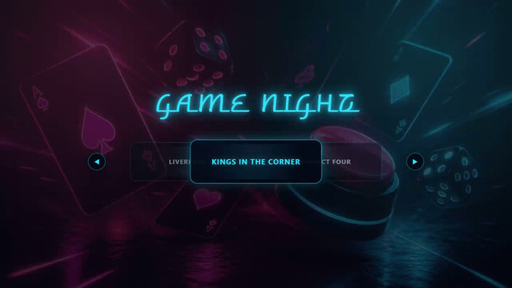

# GameNight

Multi-game tabletop card and board game suite with a unified React/Vite UI and native game logic.

Deployed on Netlify and playable at https://gamenight-solo.netlify.app/.



## Supported Games

- **Kings in the Corner** — A fun solitaire-style card game of strategy and speed.
- **Connect Four** — The classic game making strategic connections from dropping colored orbs into board game columns.
- **Liverpool Rummy** — Multi-round rummy variant with complex meld and discard rules.

## Setup

Navigate to the UI workspace:

```bash
cd src/gamenight-ui
npm install
```

## Run

Start the development server at `http://127.0.0.1:5173/`:

```bash
npm run dev -- --host 127.0.0.1
```

## Test

Run unit tests:

```bash
npm test
```

Run Liverpool E2E suite:

```bash
npm run test:e2e:liverpool
```

Run focused E2E check (example):

```bash
npm run test:e2e:liverpool -- --grep "cut-preview|round five cut|cut control"
```

## Build

Create a production build:

```bash
npm run build
```

Verify the build in preview mode:

```bash
npm run preview
```

## Code Quality

Run linter:

```bash
npm run lint
```

## Demo Asset

Regenerate the landing-page demo GIF above (starts its own dev server, records with Playwright, encodes with ffmpeg):

```bash
node scripts/capture-landing-demo.mjs
```

The script steps down resolution and frame rate until the GIF is under 5 MB and writes it to `assets/gamenight-landing-demo.gif`.

Run combined security audit and custom security scan:

```bash
npm run security:check
```

## Development Fixtures

Liverpool includes a dev cut-preview fixture in the live app via `?game=liverpool&fixture=cut-preview`.

## Documentation

Detailed game rules are in the [rulebook](rulebook/README.md).
